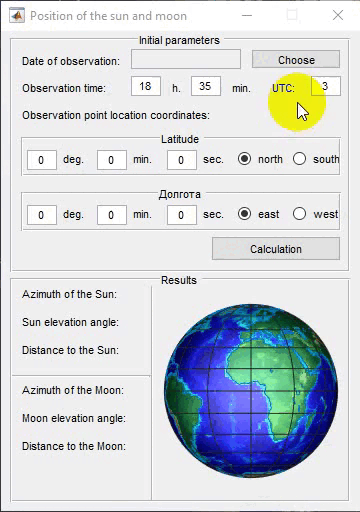

<h1 align="center">Position of the Sun and Moon</h1>

### Description  

 This is a desktop application for calculating the azimuth, elevation and approximate value of the Sun and Moon by the parameter of the observation point.

Calculation expressions used from [this](http://stjarnhimlen.se/comp/tutorial.html) resource. 

---

TAGS :label:: Sun, Moon, position, azimuth, elevation